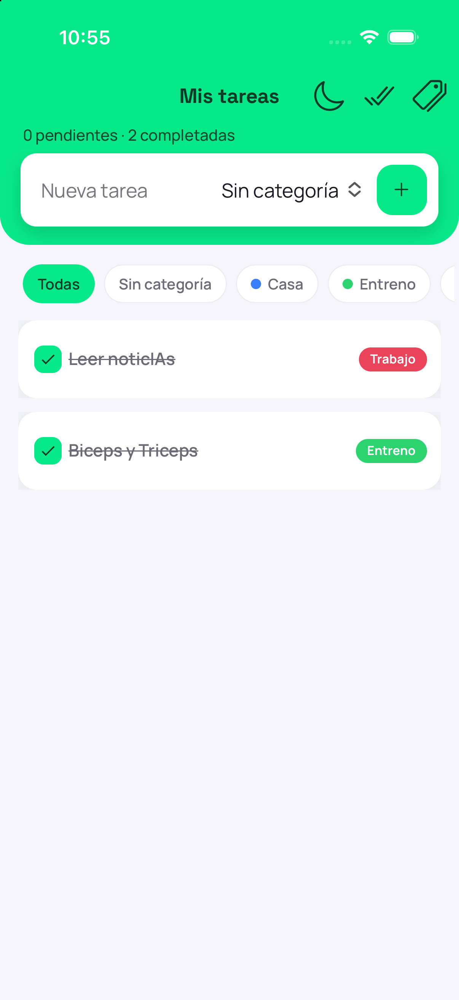
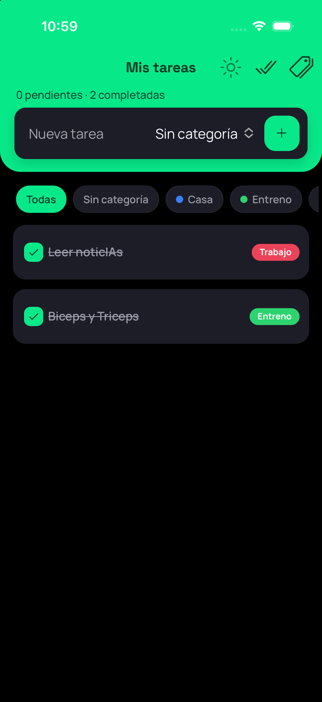
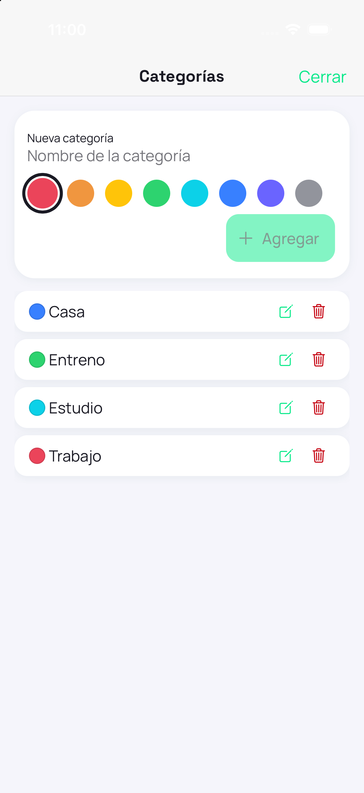
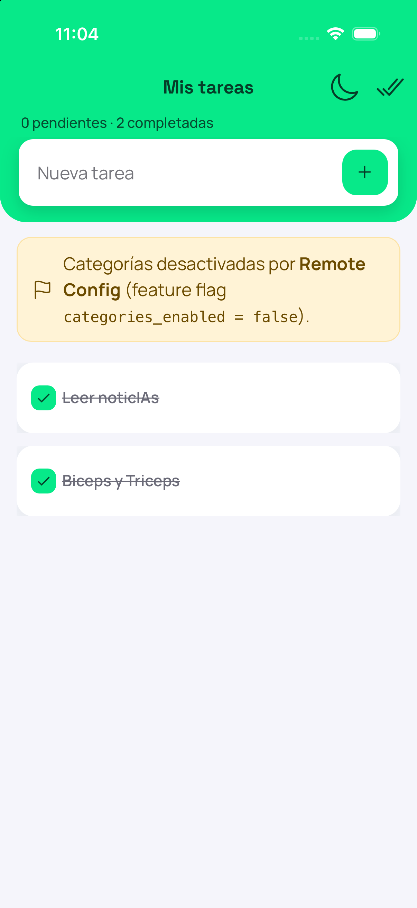

# To-Do List — Prueba técnica (Mobile Ionic)

Aplicación de lista de tareas con **categorías** activables mediante un **feature
flag remoto** (Firebase Remote Config). Construida con **Ionic + Angular** y
compilada a Android e iOS con **Apache Cordova**, siguiendo una **arquitectura
hexagonal**.

> 🎥 **Demo del feature flag:**
> [Ver video](https://uconet-my.sharepoint.com/:v:/g/personal/harby_garcia8016_uco_edu_co/IQBTYmug3G0JTr3AcD7QCdESAaLUsO-jvoFoVfFwNy2G3i8?nav=eyJyZWZlcnJhbEluZm8iOnsicmVmZXJyYWxBcHAiOiJTdHJlYW1XZWJBcHAiLCJyZWZlcnJhbFZpZXciOiJTaGFyZURpYWxvZy1MaW5rIiwicmVmZXJyYWxBcHBQbGF0Zm9ybSI6IldlYiIsInJlZmVycmFsTW9kZSI6InZpZXcifX0%3D&e=XCe26l).
> El video muestra cómo, al cambiar `categories_enabled` en Remote Config, la
> funcionalidad de categorías aparece o desaparece en la app.

---

## 📥 Descargas (APK e IPA)

Binarios de la app demo, publicados en el **[Release v1.0.0](https://github.com/harbygarcia8/todo-list-app/releases/tag/v1.0.0)**:

| Plataforma | Archivo | Descarga directa |
|---|---|---|
| 🤖 Android | `app-debug.apk` | [Descargar APK](https://github.com/harbygarcia8/todo-list-app/releases/download/v1.0.0/app-debug.apk) |
| 🍏 iOS | `todo-list.ipa` | [Descargar IPA](https://github.com/harbygarcia8/todo-list-app/releases/download/v1.0.0/todo-list.ipa) |

> El **APK** se instala directamente en cualquier Android. El **IPA** (firmado con
> cuenta Apple gratuita) instala en un iPhone registrado; para revisión sin
> dispositivo, la vía recomendada es el **simulador de iOS** (ver más abajo).

---

## 📸 Capturas

<table>
  <tr>
    <td align="center"><b>Tareas · claro</b><br></td>
    <td align="center"><b>Tareas · oscuro</b><br></td>
  </tr>
  <tr>
    <td align="center"><b>Gestor de categorías</b><br></td>
    <td align="center"><b>Feature flag desactivado</b><br></td>
  </tr>
</table>

---

## 🧱 Stack

| Capa | Tecnología |
|---|---|
| UI | **Ionic 8** (componentes standalone, modo adaptativo iOS/Material) |
| Framework | **Angular 20** (standalone APIs + **Signals**) |
| Compilación híbrida | **Apache Cordova** (`cordova-android` 15.x, `cordova-ios` 8.x) |
| Feature flags | **Firebase Remote Config** (carga *lazy*) |
| Persistencia | `@ionic/storage-angular` (IndexedDB) |
| Arquitectura | **Hexagonal** (dominio / aplicación / infraestructura / features) |
| Tests | Karma + Jasmine (86 tests, ~91% de cobertura) |

---

## ✅ Requisitos previos

Instala y verifica lo siguiente antes de empezar:

| Herramienta | Versión recomendada | Verificar |
|---|---|---|
| **Node.js** | 20.x LTS | `node -v` |
| **npm** | 10.x | `npm -v` |
| **Ionic CLI** | 7+ | `ionic -v` |
| **Cordova CLI** | 13 | `cordova -v` |
| **JDK** (Android) | 21 | `java -version` |
| **Android Studio + SDK** | Giraffe+ | `echo $ANDROID_HOME` |
| **Xcode** (solo macOS, para iOS) | 15+ | `xcodebuild -version` |
| **CocoaPods** (iOS) | 1.16 | `pod --version` |

Instala las CLIs globales si no las tienes:

```bash
npm install -g @ionic/cli cordova
```

**Variables de entorno (Android):** asegúrate de tener `ANDROID_HOME` apuntando al
SDK y las `platform-tools` en el `PATH`. Ejemplo (macOS/Linux):

```bash
export ANDROID_HOME="$HOME/Library/Android/sdk"
export PATH="$PATH:$ANDROID_HOME/platform-tools:$ANDROID_HOME/emulator"
```

---

## 🚀 Clonar e instalar

```bash
# 1. Clonar
git clone https://github.com/harbygarcia8/todo-list-app.git
cd todo-list-app

# 2. Instalar dependencias
npm install

# 3. Restaurar las plataformas y plugins de Cordova
cordova prepare
```

> ℹ️ `cordova prepare` lee `config.xml` y recrea `platforms/android`,
> `platforms/ios` y `plugins/`. Es el paso que "reconstruye" el proyecto nativo
> tras clonar.

---

## 🌐 Ejecutar en el navegador (desarrollo)

La forma más rápida de ver la app y desarrollar con *hot reload*:

```bash
npm start
```

Abre **http://localhost:4200**. `todo-list-app`.

---

## 🤖 Android — emulador y APK

### Emular en un emulador de Android

```bash
# 1. Lista tus emuladores (AVD) y arranca uno
emulator -list-avds
emulator -avd <NOMBRE_DEL_AVD> &

# 2. Compila el web + despliega en el emulador
npm run android
```

`npm run android` ejecuta `ng build --configuration production && cordova build
android` y despliega el APK en el emulador/dispositivo conectado.

### Generar el APK (debug — instala en cualquier Android)

```bash
npm run build:prod
cordova build android
```

📍 APK generado en:

```
platforms/android/app/build/outputs/apk/debug/app-debug.apk
```

### Generar el APK de release (firmado)

Para un APK "de entrega", fírmalo con un *keystore* propio:

```bash
# 1. Crear el keystore (UNA sola vez — NO se sube al repo)
keytool -genkey -v -keystore todo-list-release.keystore \
  -alias todo-list -keyalg RSA -keysize 2048 -validity 10000

# 2. Compilar y firmar
npm run build:prod
cordova build android --release -- \
  --keystore=todo-list-release.keystore \
  --alias=todo-list \
  --storePassword=TU_PASSWORD \
  --password=TU_PASSWORD
```

📍 APK firmado en:

```
platforms/android/app/build/outputs/apk/release/app-release.apk
```

Para instalar un APK manualmente en un dispositivo conectado:

```bash
adb install -r platforms/android/app/build/outputs/apk/debug/app-debug.apk
```

---

## 🍏 iOS — simulador, dispositivo e IPA (solo macOS)

### Preparar el proyecto iOS

```bash
npm run build:prod
cordova prepare ios
```

> El hook `hooks/fix-ios-deployment-target.js` eleva el *deployment target* a
> **15.0** automáticamente (Xcode reciente no admite versiones menores).

### Emular en el simulador de iOS

```bash
open platforms/ios/App.xcworkspace
```

En Xcode: elige un simulador (p. ej. **iPhone 17**) y pulsa **▶ Run** (⌘R).

>  **Esta es la vía recomendada para revisar la app en iOS**

### Correr en un iPhone físico (cuenta Apple gratuita)

1. Conecta el iPhone por USB y toca **Confiar** en el equipo.
2. En Xcode → target **App** → **Signing & Capabilities** → marca *Automatically
   manage signing* y selecciona tu **Team**.
3. Elige tu iPhone como destino → **▶ Run**.
4. En el iPhone: **Ajustes → General → VPN y gestión de dispositivos** → confía en
   el certificado *Apple Development*.

### Generar el IPA (cuenta Apple gratuita — empaquetado manual)

Con una cuenta gratuita, el botón *Distribute App* de Xcode no está disponible.
Se genera el IPA empaquetando el `.app` firmado del *Archive*:

```bash
# 1. En Xcode: destino "Any iOS Device (arm64)" → menú Product → Archive
# 2. Empaquetar el .app en un .ipa
ARCH=$(ls -dt ~/Library/Developer/Xcode/Archives/*/*.xcarchive | head -1)
APP="$ARCH/Products/Applications/To-Do List.app"
mkdir -p dist
STAGE=$(mktemp -d); mkdir -p "$STAGE/Payload"
cp -R "$APP" "$STAGE/Payload/"
( cd "$STAGE" && zip -r -q -y todo-list.ipa Payload )
mv -f "$STAGE/todo-list.ipa" dist/todo-list.ipa
rm -rf "$STAGE"
```

📍 IPA generado en:

```
dist/todo-list.ipa
```

---

## 🔧 Firebase Remote Config (feature flag)

La app lee el flag **`categories_enabled`** desde Firebase Remote Config:

- **`true`** → las categorías están activas (chips de filtro, gestor de
  categorías, asignación por tarea).
- **`false`** → la app oculta las categorías y muestra un aviso; las tareas
  siguen funcionando.

La configuración de Firebase (claves públicas de cliente) está en
`src/environments/environment.ts`. Al cambiar el valor en la consola de Firebase,
**reinicia la app** para reflejar el cambio (Remote Config es *pull-based* y el
SDK web no soporta *realtime*).

---

## 🧪 Tests

```bash
# Interactivo (abre Chrome)
npm test

# Headless con reporte de cobertura (para CI)
ng test --watch=false --browsers=ChromeHeadless --code-coverage
```

Reporte HTML de cobertura: `coverage/todo-list-app/index.html`.

---

## 📁 Estructura del proyecto (hexagonal)

```
src/app/
├── core/
│   ├── domain/            # Entidades, value objects, Result<T,E> (TS puro)
│   ├── application/       # Puertos (interfaces) + casos de uso
│   └── infrastructure/    # Adaptadores: persistencia, Firebase, DI
├── features/
│   ├── tasks/             # Pantalla principal + facade (Signals) + componentes
│   └── categories/        # Modal de gestión de categorías
├── shared/                # ThemeService (claro/oscuro)
└── theme/variables.css    # Tokens de marca (el color vive aquí)
```

---

## 📦 Artefactos de entrega

| Artefacto | Ruta |
|---|---|
| APK (Android) | `platforms/android/app/build/outputs/apk/debug/app-debug.apk` |
| IPA (iOS) | `dist/todo-list.ipa` |

---

## 🧩 Cambios realizados

Como no se entregó una base, construí la app completa y, sobre ella, desarrollé la
**funcionalidad nueva** que pedía la prueba: las **categorías**. Todo el trabajo de
esa feature se hizo en una rama aparte (`feature/categorias`) siguiendo GitFlow
(`feature/categorias` → `develop` → `main`).

**Base de la app**
- CRUD de tareas: crear, completar, editar y eliminar, con persistencia local
  (IndexedDB).
- Modo claro/oscuro.

**Funcionalidad nueva — categorías** (detrás del feature flag `categories_enabled`)
- Crear, editar y eliminar categorías (nombre + color). Al borrar una categoría se
  aplica una regla en **cascada**: las tareas que la tenían quedan sin categoría,
  para no dejar referencias huérfanas.
- Asignar una categoría a cada tarea y **filtrar** la lista por categoría.
- Todo gobernado por el flag remoto: si está en `false`, la app oculta las
  categorías y sigue funcionando como una lista de tareas simple.

**Plataforma y entrega**
- Compilación híbrida con **Cordova** a Android e iOS; **APK** e **IPA** generados.
- **Firebase Remote Config** para el feature flag.
- Rediseño visual (tokens de color, tipografía propia, modo adaptativo iOS/Material).
- Suite de **tests unitarios** (86 tests, ~91% de cobertura).

---

## 💬 Respuestas a las preguntas de la prueba

### ¿Cuáles fueron los principales desafíos al implementar las nuevas funcionalidades?

Siendo honesto, la lógica de tareas y categorías no fue lo difícil: eso es un CRUD.
Los retos reales estuvieron en la parte híbrida y de plataforma:

- **Cordova sobre un Angular moderno.** La prueba pedía Cordova (no Capacitor), pero
  el builder de Ionic para Cordova no es compatible con el nuevo compilador de
  Angular (esbuild). Me tocó desacoplar el proceso: Angular genera el web
  (`ng build`) y Cordova solo empaqueta (`cordova build`). No es el camino "feliz"
  de la documentación, pero es el que funciona hoy.
- **Xcode reciente.** Xcode 26 rechaza los *deployment targets* antiguos que genera
  cordova-ios. Lo resolví con un hook que eleva el target a 15.0 de forma
  automática, para no editar a mano archivos generados.
- **El teclado tapando la pantalla en iOS.** Al abrir el teclado, el WebView se
  redimensionaba entero y la pantalla se iba en blanco. El arreglo fue cambiar el
  modo de redimensionado del teclado a `ionic` y mover el formulario de categorías
  del *footer* al contenido, donde el scroll de Ionic sí lo respeta.
- **El IPA con cuenta de Apple gratuita.** Descubrí que Apple no permite distribuir
  un IPA sin cuenta de pago; terminé empaquetándolo manualmente desde el *archive*.
  Me pareció importante entender la limitación para documentarla con honestidad en
  vez de prometer algo que no se puede.

Siento que el mayor desafío fue la **cadena de compilación híbrida**, no el dominio
de negocio.

### ¿Qué técnicas de optimización de rendimiento aplicaste y por qué?

No optimicé por optimizar; cada decisión respondió a un problema concreto que vi:

- **Carga diferida de Firebase.** El SDK pesa ~760 kB y solo lo uso para leer un
  flag. Dejarlo en el arranque hacía que el bundle inicial se pasara del
  presupuesto, así que lo cargo con `import()` dinámico: no entra en el bundle
  inicial y la app arranca ligera. Además dejé *budgets* de producción
  configurados para que el bundle no vuelva a crecer sin que me dé cuenta.
- **Virtual scroll (CDK).** Una lista de tareas puede crecer, y renderizar un nodo
  por tarea no escala. Con `cdk-virtual-scroll` el DOM solo mantiene los ítems
  visibles (p. ej. 60 tareas → ~12 nodos en pantalla).
- **Signals + OnPush + entidades inmutables.** El estado vive en Signals y los
  componentes usan `OnPush`. Como las entidades son inmutables (cada cambio
  devuelve una instancia nueva), Angular detecta el cambio por referencia y
  re-renderiza solo lo necesario.

La idea de optimiazaión es que la App arranque rápido y que la UI re-renderice sobre cambios en el uso de la aplicación.

### ¿Cómo aseguraste la calidad y mantenibilidad del código?

Para mí, mantenibilidad es poder volver en seis meses y cambiar algo sin romper
todo. Lo abordé así:

- **Arquitectura hexagonal.** El dominio y los casos de uso son TypeScript puro, sin
  Angular ni Cordova. La infraestructura (IndexedDB, Firebase) son adaptadores
  detrás de puertos (interfaces). Si mañana cambio IndexedDB por una API, solo toco
  un adaptador; la lógica de negocio ni se entera.
- **Errores como valores (`Result<T,E>`) y branded types.** En vez de lanzar
  excepciones, las operaciones que pueden fallar devuelven un `Result` que el
  compilador obliga a manejar. Y los IDs están "marcados", así no puedes pasar un
  `CategoryId` donde va un `TaskId`. Son detalles, pero evitan errores comunes.
- **Tests.** Escribí 86 tests (~91% de cobertura), me concentré en el dominio y los casos de uso, que es donde vive la lógica. La UI la probé de forma más ligera.
- **Un solo lugar para el color.** El color de marca es un token en
  `theme/variables.css`; cambiarlo actualiza toda la app. Detalles así hacen el
  código fácil de mantener.

---

## 👨🏾‍💻 Prueba Técnica hecha por: Harby García Grajales.
